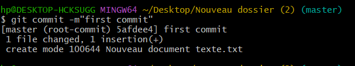
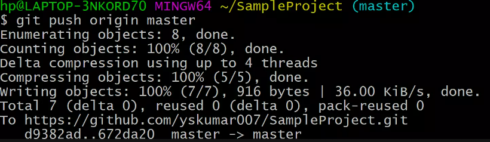
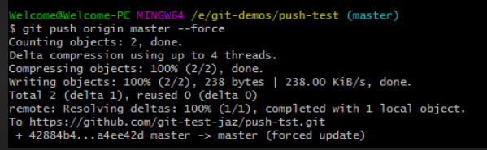

## Saving changes

---

## `git commit`

> **git commit** commande crée une nouvelle validation avec les modifications qui ont été effectuées. Il est important d'inclure un message de validation significatif.
>
> 
>
> pour plus de detail :[setting-up](setting-up.md)

## `git push`

- option

> **git push origin master**
>
> Cette commande pousse les validations de votre branche « principale » locale vers la branche « principale » du référentiel distant. Ajustez les noms des branches selon vos besoins.
>
> 

> **git push --all origin**
>
> **pousser toutes les branches ,Cela pousse toutes les branches vers le nom du référentiel distant**
>
> 

> **git push --force origin branch-name**
>
> pour Forcer la poussée
>
> 
