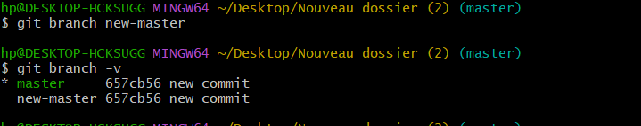
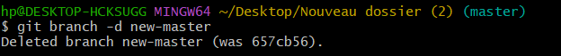
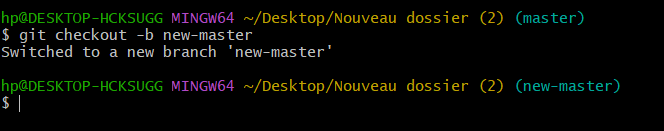
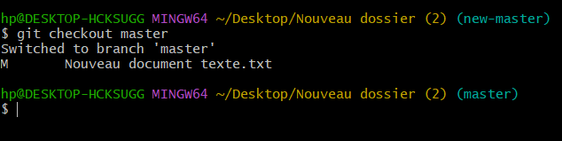
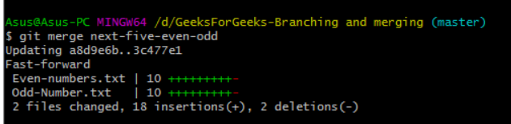
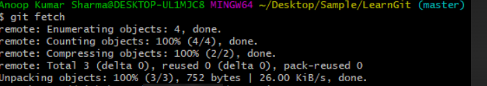

# Working with branches

## `branche`

- Option

> **git branch new-branch**
>
> pour créer une branche sans y basculer immédiatement
>
> 

> **git branch -d branch-name**
>
> pour supprimer une branch locale
>
> 

## `checkout`

- Option

> **git checkout -b name-branch**
>
> ela crée une nouvelle branche nommée **name-branch** et faire un switch a la branch
>
> 

> `git checkout existing-branch`
>
> pour Basculer vers une branche existante
>
> 

## `git-merge`

> **git merge other-branch**
>
> pour fusionner les modifications d'une autre branche dans votre branche actuelle :
>
> 

## `git-fetch`

> `git fetch`
>
> pour récupérer des informations sur les branches distantes :
>
> 
