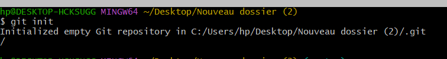
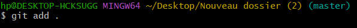

# Setting up

## `git init`

La git initcommande est utilisée pour initialiser un nouveau référentiel Git. Lorsque vous exécutez cette commande dans un répertoire de projet, elle configure tous les fichiers et répertoires nécessaires dont Git a besoin pour commencer à suivre les modifications dans votre projet.

---

## `git config`

Les commandes Git pour configurer votre **nom d'utilisateur** et votre **adresse e-mail** sont les suivantes :

- _option_

> `` 'git config --global user.name`  ``
>
> 

> `` _**'git config --global user.email`**_ ``
>
> 

---

## `git add`

utilisez la commande suivante pour ajouter tous les fichiers de votre projet à la zone de préparation :

- _option_

> `git add .`
>
> pour ajouter toutes les modifications (fichiers nouveaux, modifiés ou supprimés) à la zone de préparation, vous pouvez utiliser le point ( **.**) :
>
> 

> `git add -u`
>
> Ajouter des fichiers modifiés et supprimés (à l'exclusion des fichiers non suivis)
>
> 

> `git add --all`
>
> Ajouter des répertoires de manière récursive
>
> 

---

## `git commit`

**git commit** commande est utilisée pour enregistrer vos modifications dans le référentiel local. Lorsque vous exécutez cette commande, vous créez un nouveau commit qui représente un instantané de votre projet à ce moment-là.

- _option_

> `**git commit -m**`
>
> **m** option vous permet d'ajouter le message directement depuis la ligne de commande :
>
> 

> `**git commit --amend**`
>
> pour  apporter des modifications au dernier commit (par exemple, pour ajouter un fichier que vous avez oublié), vous pouvez utiliser  **\--amend** ou **\--ammend -m** pour modifier le message
>
> 

> `**git commit --amend--no-edit**`
>
> La commande **\`git commit --amend --no-edit\`** est utilisée pour modifier le dernier commit sans changer le message de commit
>
> 
